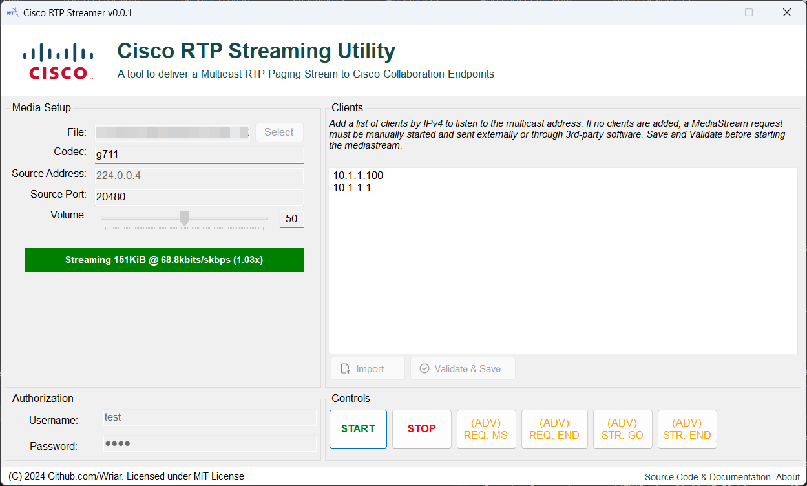

# Cisco RTP MultiCast Streamer
Cisco RTP MultiCast Steamer is a Windows Application to stream RTP MultiCast audio to Cisco Phones. Given a prerecorded ``g711 mu-law`` codec .wav file, the application automatically starts a mediastream and streams the audio file to the Multicast IP address. It can be used to troubleshoot network MultiCast streaming or the mediastream capability on Cisco Phones.

## Instructions:
1. Download the release or build the application. Ensure bundled FFMPEG is included in the application directory.
2. Add phone IPv4s to the MultiCast IP Box. These can also be imported from a TXT or CSV file, assuming one IP per line.
3. Complete the media setup area. Recommended values are prefilled.
4. Fill in the authorization username or password. This is the credential verified by the ``<authenticationURL>`` in the phone's configuration XML.
5. Press Start. The listed Cisco Phones will automatically begin playing the audio file selected. To STOP, press the Stop button.

## Advanced:
1. To only send a CGI RTP multicast listening request to the phones but NOT start the audio stream, click the ``(ADV) REQ. MS`` button. To end that request, click the ``(ADV) REQ. END`` button.
2. To only start a MultiCast RTP audio stream but not send the CGI media query to the phones, click the ``(ADV) STR. GO`` button. To end that stream, click the ``(ADV) STR. END`` button.

## Considerations:
* As of now, only the ``g711`` mu-law codec is supported. You may convert an audio file to ``g711`` by visiting https://g711.org.
* To ensure a steady multicast stream, the streaming appliance must have high bandwidth access to the network, preferrably a wired connection.
* This software is intended for Windows machines with .NET framework.

## Acknowledgements:
* This software was built to the specifications of *Cisco Unified IP Phone Services Application Development Notes R7*.
* Compiled FFMPEG is included in the build folder; you may use your own build if you wish.
